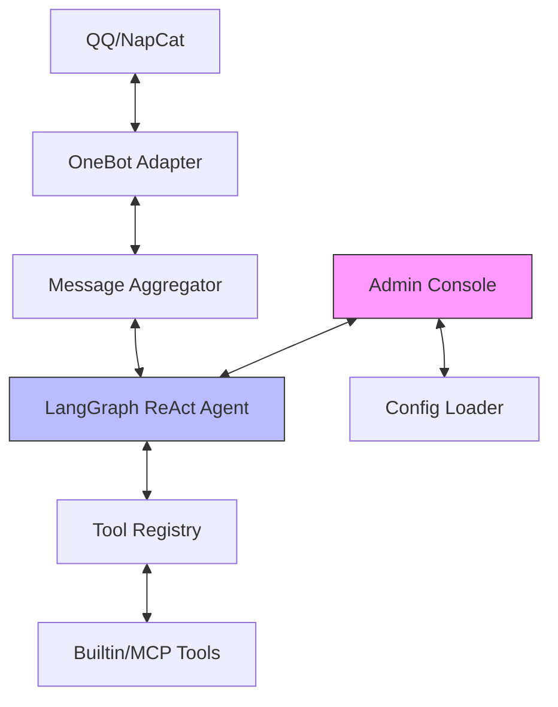

# LangGraph QQ Agent

> 一个基于 **Python** + **LangGraph** + **NapCat (OneBot11)** + **MCP** 构建的现代化智能 QQ 机器人。

本项目旨在构建一个高度可扩展、具备复杂推理能力和工具使用能力的 Agent，而非简单的对话机器人。它利用 LangGraph 的图编排能力管理对话状态，通过 MCP 协议无限扩展外部工具库，并提供完善的管理后台。

## ✨ 核心特性

- **🤖 ReAct Agent 架构**：基于 LangGraph 的思考→行动→观察循环，支持深度多轮推理。
- **🌐 现代化管理后台**：内置基于 FastAPI + Vue 的 Admin Console，支持在线配置、工具管理、沙盒调试及日志监控。
- **🖼️ 多模态深度支持**：完美处理图片、表情、引用回复、合并转发，能“看懂”复杂的上下文。
- **🔧 MCP 工具生态**：原生支持 Model Context Protocol，可一键接入数千个外部工具及私有 API。
- **🛡️ 工业级稳定性**：内置断路器 (Circuit Breaker)、指数退避重试 (Exponential Backoff) 及完善的错误隔离。
- **📊 智能消息聚合**：针对高频群聊设计的智能聚合器，自动合并连续发言，大幅削减 Token 消耗。
- **🔄 配置全热重载**：无需重启，实时修改角色预设、工具开关及核心配置。

---

## 🚀 快速开始

### 1. 环境准备

```bash
# 创建并激活环境 (Python 3.11+)
conda create -n qqagent python=3.11 -y
conda activate qqagent

# 安装项目依赖
pip install -e .
```

### 2. 配置文件

```bash
cp .env.example .env
```

编辑 `.env`：

```env
# ===== LLM 配置 =====
OPENAI_API_KEY=sk-xxxx
OPENAI_API_BASE=https://api.openai.com/v1
DEFAULT_MODEL=gpt-4o-mini

# ===== OneBot 配置 =====
ONEBOT_MODE=reverse                    # reverse/forward/both
ONEBOT_REVERSE_WS_PORT=5140
ONEBOT_TOKEN=                          # 可选

# ===== 管理后台 =====
ADMIN_PASSWORD=admin                   # 管理员登录密码
ADMIN_SECRET_KEY=xxxx                  # JWT 签名密钥

# ===== Agent 行为 =====
AGENT_DEFAULT_PRESET=琪露诺            # 默认角色预设
AGENT_ALLOW_AT_REPLY=true              # 响应 @
AGENT_ALLOW_PRIVATE=true               # 响应私聊
AGENT_ALLOW_ALL_GROUP_MSG=false        # 响应所有群消息（无需@）
AGENT_SILENT_ERRORS=false              # 出错时静默（不发送错误提示）
AGENT_MAX_HISTORY_MESSAGES=70          # 历史消息保留数量

# ===== 会话管理 =====
AGENT_SESSION_GLOBAL_USERS=[]          # 全局用户 (共享上下文)
AGENT_SESSION_PER_USER_GROUPS=[]       # 用户隔离的群列表
AGENT_SESSION_ALL_GROUPS_PER_USER=false

# ===== LangSmith 调试 (可选) =====
LANGCHAIN_TRACING_V2=true
LANGCHAIN_API_KEY=lsv2_pt_xxx
LANGCHAIN_PROJECT=langgraph-qq-agent
```

### 3. 配置 NapCat

1. 启动 NapCat (推荐 Docker 或 Windows 客户端)
2. WebUI → 网络配置 → **WebSocket 客户端**
3. 添加 URL: `ws://127.0.0.1:5140/onebot`

### 4. 启动

```bash
python -m src.main
```

- **机器人状态**：查看终端 `Bot connected!` 提示。
- **管理后台**：访问 `http://localhost:8088`。

---

## 🖥️ 管理后台 (Admin Console)

全新的 Web 管理界面，让机器人管理从此触手可得：

- **面板首页**：实时查看机器人状态、最近消息统计。
- **沙盒调试**：在 Web 界面直接与 Agent 模拟对话，测试逻辑无需打开 QQ。
- **工具管理**：实时启用/禁用内置工具及 MCP 工具，查看工具调用详情。
- **配置管理**：在线编辑 `config.yaml` 和 `secrets`。
- **日志监控**：实时滚动查看后端详细日志。

---

## 🛠️ 技术架构



**数据流**：
1. QQ 消息 → OneBot 适配器解析
2. 图片下载、引用获取、转发内容提取
3. 构建多模态 LangChain 消息
4. Agent 循环处理（可能多轮工具调用）
5. 通过 `send_message` 工具发送回复
6. 历史存入 SQLite

**📂 关键目录说明**：

- `src/adapters/`: 处理 OneBot 协议组件及 MCP 客户端逻辑。
- `src/admin/`: 完整的 FastAPI 后端及预编译的 Vue 前端资产。
- `src/agent/`: 核心逻辑。`graph.py` 定义状态机，`tool_registry.py` 管理工具热插拔。
- `src/core/`: 底层支持。包含多模态消息构建、异常处理系统及**弹性重试**机制。
- `src/session/`: 复杂的会话分流与消息防抖聚合。

---

## 📂 项目结构

```
qqagent/
├── config/
│   ├── mcp_servers.json        # MCP 工具服务器配置
│   └── presets/                # 角色预设 (YAML)
│       ├── default.yaml
│       └── 琪露诺.yaml
├── src/
│   ├── adapters/               # 协议适配
│   │   ├── onebot.py           # OneBot WebSocket
│   │   └── mcp.py              # MCP 客户端
│   ├── admin/                  # 管理后台
│   │   ├── api/                # FastAPI 后端
│   │   └── web/                # Vue 前端 (编译后)
│   ├── agent/                  # Agent 核心
│   │   ├── graph.py            # LangGraph 定义
│   │   ├── state.py            # 状态类型
│   │   ├── tools.py            # 内置工具
│   │   └── tool_registry.py    # 工具注册与管理
│   ├── core/                   # 底层工具函数
│   │   ├── onebot.py           # 消息解析/构建
│   │   ├── media.py            # 图片下载/编码
│   │   ├── llm_message.py      # LangChain 消息
│   │   └── error_handling.py   # 错误处理与重试
│   ├── memory/                 # 存储
│   │   └── store.py            # SQLite 持久化
│   ├── session/                # 会话管理
│   │   ├── manager.py          # Session ID 策略
│   │   └── aggregator.py       # 群消息聚合
│   ├── presets/                # 预设加载
│   ├── utils/                  # 工具模块
│   └── main.py                 # 入口
├── data/
│   └── sessions.db             # SQLite 数据库
└── .env                        # 敏感配置
```

---

## 🔧 MCP 工具配置

在 `config/mcp_servers.json` 中配置：

```json
{
  "mcpServers": {
    "search": {
      "command": "npx",
      "args": ["-y", "@tavily/mcp-server-tavily-search"],
      "env": { "TAVILY_API_KEY": "xxx" }
    }
  }
}
```

---

## 🎭 角色预设

在 `config/presets/` 创建 YAML 文件：

```yaml
name: 猫娘
system_prompt: |
  你是一只可爱的猫娘，说话带「喵」。
  你会卖萌，喜欢被摸头。
keywords:
  - 猫娘
  - 喵
```

通过 `AGENT_DEFAULT_PRESET=猫娘` 启用。

---

## 🧪 沙盒测试

无需 QQ，直接在终端测试：

```bash
# CLI 模式
python -m src.sandbox

# Web 模式 (带 UI)
python -m src.sandbox_web
```

---

## 📄 开源协议

本项目采用 **MIT** 协议开源。
