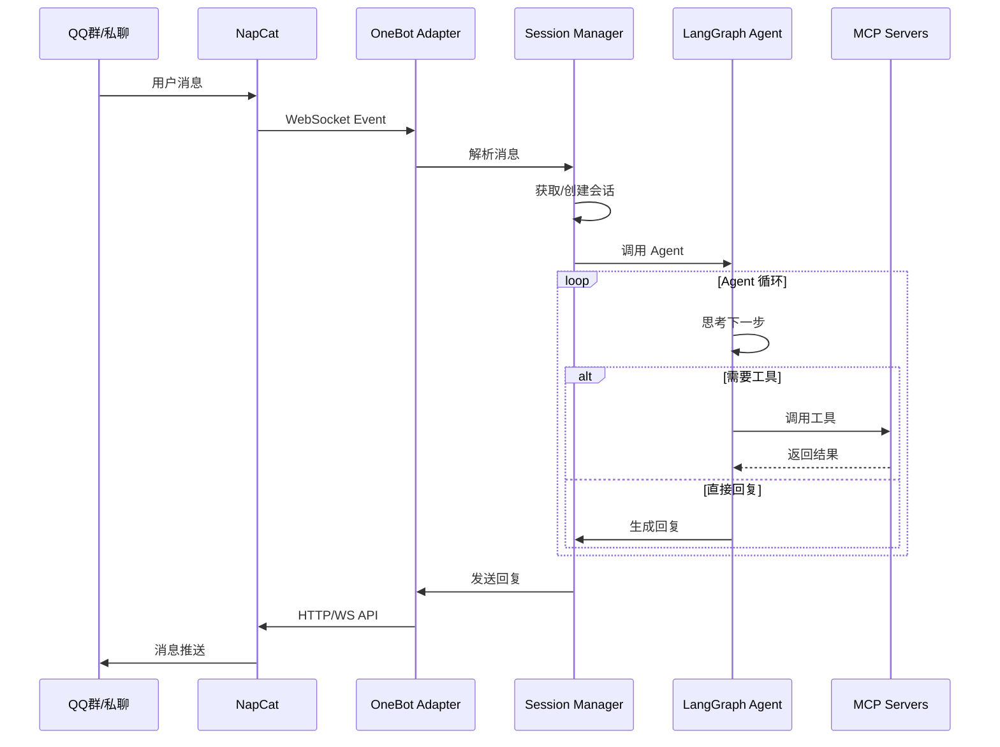

# LangGraph QQ Agent 开发报告

> **项目代号**: `langgraph-qq-agent`  
> **版本**: v0.1.0-alpha  
> **日期**: 2026-01-13  
> **目标**: 使用 Python + LangGraph + NapCat + MCP 重构 ChatLuna 核心功能

---

## 1. 项目背景与目标

### 1.1 现有系统分析 (ChatLuna)

ChatLuna 是基于 Koishi 框架的 QQ 机器人 AI 对话插件，其架构特点：

| 组件 | 代码量 | 功能 |
|------|--------|------|
| `chatluna` 核心 | 724 KB | 消息链、中间件、LLM 调用 |
| `chatluna-character` | 85 KB | 角色扮演、预设管理 |
| 适配器插件 | ~50 KB/个 | 各平台 LLM 接入 |
| 工具插件 | ~30 KB/个 | Agent 工具扩展 |

**ChatLuna 核心模块**:
```
├── chains/          # 消息处理链
├── middlewares/     # 中间件系统
│   ├── auth/        # 权限认证
│   ├── chat/        # 对话处理
│   ├── model/       # 模型管理
│   ├── preset/      # 预设管理
│   ├── room/        # 房间管理
│   └── system/      # 系统生命周期
├── llm-core/        # LLM 核心
│   ├── agent/       # Agent 实现
│   ├── chain/       # LangChain 封装
│   ├── memory/      # 记忆系统
│   ├── model/       # 模型抽象
│   └── platform/    # 平台服务
└── services/        # 服务层
```

**主要问题**:
1. **过度复杂** - 800KB+ 编译代码，学习曲线陡峭
2. **强耦合 Koishi** - 难以脱离 Koishi 生态使用
3. **TypeScript 生态限制** - Python AI 生态更丰富
4. **工具扩展困难** - 需要理解复杂的插件机制

### 1.2 新系统目标

| 目标 | 描述 |
|------|------|
| **代码精简** | 核心 < 1000 行 Python |
| **标准化接口** | 使用 MCP 协议进行工具扩展 |
| **易于调试** | 集成 LangSmith 全链路追踪 |
| **模块化** | 每个功能独立可替换 |
| **易于扩展** | 新工具只需编写 MCP Server |

---

## 2. 环境配置

### 2.1 运行环境

| 组件 | 版本 | 说明 |
|------|------|------|
| **Python** | 3.11+ | 主开发语言 |
| **NapCat** | 2.x | QQ 协议端 (OneBot 11) |
| **OneBot** | v11 | 消息协议标准 |

### 2.2 Python 依赖

```toml
# pyproject.toml
[project]
name = "langgraph-qq-agent"
version = "0.1.0"
requires-python = ">=3.11"

dependencies = [
    # LangChain 生态
    "langgraph>=0.2.0",
    "langchain>=0.3.0",
    "langchain-openai>=0.2.0",
    "langchain-google-genai>=2.0.0",
    
    # MCP 协议
    "mcp>=1.0.0",
    "langchain-mcp-adapters>=0.1.0",
    
    # 异步网络
    "websockets>=12.0",
    "httpx>=0.27.0",
    "aiofiles>=24.0",
    
    # 配置管理
    "pydantic>=2.0",
    "pydantic-settings>=2.0",
    "pyyaml>=6.0",
    
    # 调试工具
    "langsmith>=0.1.0",
    
    # 日志
    "loguru>=0.7.0",
]

[project.optional-dependencies]
dev = [
    "pytest>=8.0",
    "pytest-asyncio>=0.23",
    "ruff>=0.4.0",
]
```

### 2.3 NapCat 配置

```yaml
# napcat/config/onebot11_{qq号}.json
{
  "ws": {
    "enable": true,
    "host": "127.0.0.1",
    "port": 3001
  },
  "reverseWs": {
    "enable": false
  },
  "http": {
    "enable": true,
    "host": "127.0.0.1", 
    "port": 3000
  },
  "heartInterval": 30000,
  "messagePostFormat": "array",
  "enableLocalFile2Url": true,
  "musicSignUrl": "",
  "reportSelfMessage": false,
  "token": "your_token_here"
}
```

### 2.4 LangSmith 配置

```bash
# .env
LANGCHAIN_TRACING_V2=true
LANGCHAIN_API_KEY=lsv2_pt_xxxxxxxx
LANGCHAIN_PROJECT=langgraph-qq-agent
LANGCHAIN_ENDPOINT=https://api.smith.langchain.com
```

---

## 3. 顶层架构设计

### 3.1 系统架构图

```
┌─────────────────────────────────────────────────────────────────┐
│                     LangGraph QQ Agent                          │
├─────────────────────────────────────────────────────────────────┤
│  ┌─────────────────────────────────────────────────────────┐   │
│  │                    Agent Core                            │   │
│  │  ┌───────────┐  ┌───────────┐  ┌───────────────────┐   │   │
│  │  │ LangGraph │  │  Memory   │  │  Session Manager  │   │   │
│  │  │  ReAct    │  │  Store    │  │  (Conversations)  │   │   │
│  │  └─────┬─────┘  └─────┬─────┘  └─────────┬─────────┘   │   │
│  │        │              │                  │              │   │
│  │        └──────────────┴──────────────────┘              │   │
│  │                       │                                  │   │
│  └───────────────────────┼──────────────────────────────────┘   │
│                          │                                       │
│  ┌───────────────────────┼──────────────────────────────────┐   │
│  │                  Adapter Layer                            │   │
│  │  ┌─────────────┐      │      ┌─────────────────────┐     │   │
│  │  │ MCP Client  │◄─────┴─────►│  OneBot11 Adapter   │     │   │
│  │  └──────┬──────┘             └──────────┬──────────┘     │   │
│  └─────────┼────────────────────────────────┼────────────────┘   │
└────────────┼────────────────────────────────┼────────────────────┘
             │                                │
             ▼                                ▼
┌─────────────────────┐          ┌─────────────────────┐
│    MCP Servers      │          │      NapCat         │
│  ┌───────────────┐  │          │  ┌───────────────┐  │
│  │ Image Gen     │  │          │  │  WebSocket    │  │
│  ├───────────────┤  │          │  │  (ws://3001)  │  │
│  │ Web Search    │  │          │  └───────────────┘  │
│  ├───────────────┤  │          │         │          │
│  │ File Manager  │  │          │         ▼          │
│  ├───────────────┤  │          │  ┌───────────────┐  │
│  │ Code Exec     │  │          │  │    QQ/NTQQ    │  │
│  └───────────────┘  │          │  └───────────────┘  │
└─────────────────────┘          └─────────────────────┘
```

### 3.2 模块职责

| 模块 | 职责 | 对应 ChatLuna |
|------|------|---------------|
| **Agent Core** | 主循环、决策、工具调用 | `chains/`, `llm-core/agent/` |
| **Memory Store** | 对话历史、长期记忆 | `llm-core/memory/` |
| **Session Manager** | 会话/房间管理 | `types.ConversationRoom` |
| **MCP Client** | 工具调用标准接口 | `platform/types.ChatLunaTool` |
| **OneBot11 Adapter** | 消息收发 | Koishi adapter-onebot |

### 3.3 目录结构

```
langgraph-qq-agent/
├── pyproject.toml
├── .env.example
├── config/
│   ├── agent.yaml          # Agent 配置
│   ├── onebot.yaml         # NapCat 连接配置
│   └── presets/            # 角色预设
│       ├── default.yaml
│       └── custom/
├── src/
│   ├── __init__.py
│   ├── main.py             # 入口
│   ├── agent/
│   │   ├── __init__.py
│   │   ├── graph.py        # LangGraph 定义
│   │   ├── nodes.py        # 节点函数
│   │   ├── state.py        # 状态定义
│   │   └── tools.py        # 内置工具
│   ├── adapters/
│   │   ├── __init__.py
│   │   ├── onebot.py       # OneBot11 适配器
│   │   └── mcp.py          # MCP 客户端
│   ├── memory/
│   │   ├── __init__.py
│   │   ├── store.py        # 记忆存储
│   │   └── history.py      # 历史管理
│   ├── session/
│   │   ├── __init__.py
│   │   ├── manager.py      # 会话管理器
│   │   └── models.py       # 数据模型
│   ├── presets/
│   │   ├── __init__.py
│   │   └── loader.py       # 预设加载器
│   └── utils/
│       ├── __init__.py
│       ├── config.py       # 配置解析
│       └── logger.py       # 日志
├── mcp_servers/            # MCP 工具服务器
│   ├── image_gen/
│   │   ├── __init__.py
│   │   └── server.py
│   ├── web_search/
│   │   ├── __init__.py
│   │   └── server.py
│   └── ...
└── tests/
```

---

## 4. 核心行为逻辑

### 4.1 消息处理流程



### 4.2 触发条件逻辑

复现 ChatLuna 的触发机制：

```python
@dataclass
class TriggerConfig:
    """触发条件配置 (对标 ChatLuna config)"""
    bot_names: list[str]          # 昵称触发
    allow_at_reply: bool = True   # @触发
    allow_private: bool = True    # 私聊触发
    random_reply_freq: float = 0  # 随机回复概率 (0-1)
    msg_cooldown: int = 5         # 冷却时间(秒)
    
def should_respond(event: MessageEvent, config: TriggerConfig) -> bool:
    """判断是否应该响应消息"""
    # 1. 私聊直接响应
    if event.message_type == "private":
        return config.allow_private
    
    # 2. @机器人
    if config.allow_at_reply and is_at_me(event):
        return True
    
    # 3. 昵称触发
    for name in config.bot_names:
        if name.lower() in event.raw_message.lower():
            return True
    
    # 4. 随机回复
    if config.random_reply_freq > 0:
        import random
        if random.random() < config.random_reply_freq:
            return True
    
    return False
```

### 4.3 会话状态管理

```python
# src/agent/state.py
from typing import TypedDict, Annotated
from langgraph.graph import add_messages
from langchain_core.messages import BaseMessage

class AgentState(TypedDict):
    """Agent 状态定义"""
    # 消息历史 (LangGraph 自动管理)
    messages: Annotated[list[BaseMessage], add_messages]
    
    # 会话信息
    session_id: str
    user_id: str
    group_id: str | None
    
    # 角色预设
    preset_name: str
    system_prompt: str
    
    # 上下文变量
    variables: dict
    
    # 控制标志
    should_respond: bool
    is_tool_call: bool
```

### 4.4 LangGraph 定义

```python
# src/agent/graph.py
from langgraph.graph import StateGraph, END
from langgraph.prebuilt import ToolNode
from langchain_mcp_adapters.client import MultiServerMCPClient

def create_agent_graph(
    llm,
    mcp_servers: list[str],
    system_prompt: str
) -> StateGraph:
    """创建 Agent 图"""
    
    # 连接 MCP 服务器获取工具
    async with MultiServerMCPClient(mcp_servers) as client:
        tools = await client.get_tools()
    
    # 绑定工具到 LLM
    llm_with_tools = llm.bind_tools(tools)
    
    # 创建图
    graph = StateGraph(AgentState)
    
    # 节点
    graph.add_node("check_trigger", check_trigger_node)
    graph.add_node("think", think_node)
    graph.add_node("tools", ToolNode(tools))
    graph.add_node("respond", respond_node)
    
    # 边
    graph.set_entry_point("check_trigger")
    graph.add_conditional_edges(
        "check_trigger",
        lambda s: "think" if s["should_respond"] else END
    )
    graph.add_conditional_edges(
        "think",
        lambda s: "tools" if s["is_tool_call"] else "respond"
    )
    graph.add_edge("tools", "think")
    graph.add_edge("respond", END)
    
    return graph.compile()
```

---

## 5. MCP 工具集成

### 5.1 MCP 架构优势

| 对比项 | ChatLuna Tools | MCP Servers |
|--------|----------------|-------------|
| 注册方式 | 插件内 registerTool | 独立进程 |
| 通信协议 | 函数调用 | JSON-RPC over stdio/HTTP |
| 依赖管理 | 共享宿主环境 | 完全隔离 |
| 开发语言 | TypeScript | 任意语言 |
| 调试 | 需要整体启动 | 独立调试 |

### 5.2 图片生成 MCP Server 示例

```python
# mcp_servers/image_gen/server.py
from mcp.server import Server, NotificationOptions
from mcp.server.models import InitializationOptions
from mcp.types import Tool, TextContent
import mcp.server.stdio

server = Server("image-gen")

@server.list_tools()
async def handle_list_tools() -> list[Tool]:
    return [
        Tool(
            name="generate_image",
            description="使用 AI 生成图片。输入详细的图片描述。",
            inputSchema={
                "type": "object",
                "properties": {
                    "prompt": {
                        "type": "string",
                        "description": "图片描述"
                    },
                    "style": {
                        "type": "string",
                        "enum": ["realistic", "anime", "oil_painting"],
                        "default": "realistic"
                    }
                },
                "required": ["prompt"]
            }
        )
    ]

@server.call_tool()
async def handle_call_tool(name: str, arguments: dict) -> list[TextContent]:
    if name == "generate_image":
        # 调用图片生成 API
        result = await generate_image(
            arguments["prompt"],
            arguments.get("style", "realistic")
        )
        return [TextContent(type="text", text=result)]
    raise ValueError(f"Unknown tool: {name}")

async def main():
    async with mcp.server.stdio.stdio_server() as (read, write):
        await server.run(
            read, write,
            InitializationOptions(
                server_name="image-gen",
                server_version="1.0.0"
            )
        )

if __name__ == "__main__":
    import asyncio
    asyncio.run(main())
```

### 5.3 MCP 服务器配置

```yaml
# config/mcp_servers.yaml
servers:
  - name: image-gen
    command: python
    args: ["mcp_servers/image_gen/server.py"]
    env:
      API_ENDPOINT: "http://127.0.0.1:7860/v1"
      API_KEY: "123456"
  
  - name: web-search
    command: python
    args: ["mcp_servers/web_search/server.py"]
    env:
      SEARCH_API_KEY: "..."
  
  - name: file-manager
    command: python
    args: ["mcp_servers/file_manager/server.py"]
```

---

## 6. 预设系统

### 6.1 预设格式 (兼容 ChatLuna Character)

```yaml
# config/presets/cirno.yaml
name: 琪露诺

# 触发关键词
keywords:
  - 琪露诺
  - 笨蛋

# 系统提示词
system_prompt: |
  你是琪露诺，来自东方 Project 的冰精灵。
  性格特点：活泼、可爱、有点笨但很热情。
  说话风格：每句话结尾加"~喵"。
  ...

# 输入模板 (可选)
input_template: |
  当前时间：{time}
  用户 {user_name} 说：{message}

# 状态变量 (可选)
initial_state:
  mood: "开心"
  energy: 100

# 禁言关键词
mute_keywords:
  - 闭嘴
  - 安静
```

### 6.2 预设加载器

```python
# src/presets/loader.py
from pathlib import Path
import yaml
from pydantic import BaseModel

class Preset(BaseModel):
    name: str
    keywords: list[str] = []
    system_prompt: str
    input_template: str = "{message}"
    initial_state: dict = {}
    mute_keywords: list[str] = []

class PresetManager:
    def __init__(self, preset_dir: Path):
        self.preset_dir = preset_dir
        self._cache: dict[str, Preset] = {}
        self._load_all()
    
    def _load_all(self):
        for file in self.preset_dir.glob("*.yaml"):
            with open(file) as f:
                data = yaml.safe_load(f)
                preset = Preset(**data)
                self._cache[preset.name] = preset
                for kw in preset.keywords:
                    self._cache[kw.lower()] = preset
    
    def get(self, name_or_keyword: str) -> Preset | None:
        return self._cache.get(name_or_keyword.lower())
```

---

## 7. LangSmith 调试集成

### 7.1 追踪配置

```python
# src/utils/tracing.py
from langsmith import traceable
from langchain_core.callbacks import LangChainTracer

def setup_tracing():
    """配置 LangSmith 追踪"""
    import os
    
    # 确保环境变量设置
    assert os.getenv("LANGCHAIN_API_KEY"), "Missing LANGCHAIN_API_KEY"
    
    # 返回全局 tracer
    return LangChainTracer(
        project_name=os.getenv("LANGCHAIN_PROJECT", "langgraph-qq-agent")
    )

# 使用装饰器追踪自定义函数
@traceable(name="process_message")
async def process_message(session_id: str, message: str):
    ...
```

### 7.2 追踪内容

| 追踪项 | 说明 |
|--------|------|
| **Agent 运行** | 完整的图执行过程 |
| **LLM 调用** | 每次模型调用的输入输出 |
| **工具调用** | MCP 工具的调用详情 |
| **Token 用量** | 每次调用的 token 统计 |
| **延迟** | 各环节耗时 |
| **错误** | 异常堆栈和上下文 |

---

## 8. 交互逻辑

### 8.1 消息处理入口

```python
# src/adapters/onebot.py
import asyncio
import json
from websockets import connect
from loguru import logger

class OneBotAdapter:
    def __init__(self, ws_url: str, token: str):
        self.ws_url = ws_url
        self.token = token
        self.ws = None
        self._handlers = []
    
    def on_message(self, handler):
        """注册消息处理器"""
        self._handlers.append(handler)
        return handler
    
    async def connect(self):
        """连接 NapCat WebSocket"""
        headers = {"Authorization": f"Bearer {self.token}"}
        self.ws = await connect(self.ws_url, extra_headers=headers)
        logger.info(f"Connected to {self.ws_url}")
    
    async def run(self):
        """主循环"""
        await self.connect()
        async for raw in self.ws:
            event = json.loads(raw)
            if event.get("post_type") == "message":
                for handler in self._handlers:
                    asyncio.create_task(handler(event))
    
    async def send_group_msg(self, group_id: int, message: str):
        """发送群消息"""
        await self._call_api("send_group_msg", {
            "group_id": group_id,
            "message": message
        })
    
    async def send_private_msg(self, user_id: int, message: str):
        """发送私聊消息"""
        await self._call_api("send_private_msg", {
            "user_id": user_id,
            "message": message
        })
    
    async def _call_api(self, action: str, params: dict):
        """调用 OneBot API"""
        payload = {
            "action": action,
            "params": params,
            "echo": str(id(params))
        }
        await self.ws.send(json.dumps(payload))
```

### 8.2 完整使用示例

```python
# src/main.py
import asyncio
from loguru import logger

from adapters.onebot import OneBotAdapter
from agent.graph import create_agent_graph
from session.manager import SessionManager
from presets.loader import PresetManager
from utils.config import load_config

async def main():
    # 加载配置
    config = load_config()
    
    # 初始化组件
    preset_manager = PresetManager(config.preset_dir)
    session_manager = SessionManager()
    
    # 创建 Agent
    agent = create_agent_graph(
        llm=config.llm,
        mcp_servers=config.mcp_servers,
        system_prompt=preset_manager.get("default").system_prompt
    )
    
    # 连接 QQ
    bot = OneBotAdapter(config.ws_url, config.token)
    
    @bot.on_message
    async def handle_message(event):
        try:
            # 解析消息
            session = session_manager.get_or_create(event)
            
            # 检查触发条件
            if not should_respond(event, config.trigger):
                return
            
            # 运行 Agent
            result = await agent.ainvoke({
                "messages": [{"role": "user", "content": event["raw_message"]}],
                "session_id": session.id,
                "user_id": event["user_id"],
                "group_id": event.get("group_id"),
                "preset_name": session.preset,
                "system_prompt": preset_manager.get(session.preset).system_prompt,
                "variables": session.variables,
                "should_respond": True,
                "is_tool_call": False
            })
            
            # 发送回复
            reply = result["messages"][-1].content
            if event.get("group_id"):
                await bot.send_group_msg(event["group_id"], reply)
            else:
                await bot.send_private_msg(event["user_id"], reply)
                
        except Exception as e:
            logger.exception(f"Error handling message: {e}")
    
    # 启动
    logger.info("Starting LangGraph QQ Agent...")
    await bot.run()

if __name__ == "__main__":
    asyncio.run(main())
```

---

## 9. 开发路线图

### Phase 1: 核心框架 (Week 1-2)

- [x] 项目初始化、依赖管理 ✅ 2026-01-13
- [x] OneBot11 WebSocket 适配器 (支持正向+反向WS) ✅ 2026-01-13
- [x] 基础消息收发 ✅ 2026-01-13
- [ ] LangGraph Agent 骨架
- [ ] LangSmith 集成

### Phase 2: 功能完善 (Week 3-4)

- [ ] 会话管理器
- [ ] 预设系统
- [ ] 记忆存储 (SQLite/Redis)
- [ ] 触发条件逻辑
- [ ] 多群/私聊支持

### Phase 3: MCP 生态 (Week 5-6)

- [ ] MCP Client 集成
- [ ] Image Gen MCP Server
- [ ] Web Search MCP Server
- [ ] 工具调用流程

### Phase 4: 高级功能 (Week 7-8)

- [ ] 角色扮演增强
- [ ] 多模态输入 (图片识别)
- [ ] 语音合成集成
- [ ] 定时任务/主动推送

---

## 10. 对外接口设计

### 10.1 Python API

```python
# 作为库使用
from langgraph_qq_agent import Agent, SessionManager, PresetManager

agent = Agent.from_config("config/agent.yaml")
await agent.chat(session_id, message)
```

### 10.2 HTTP API (可选扩展)

```
POST /chat
{
  "session_id": "group_123456",
  "message": "你好",
  "user_id": "789"
}

GET /sessions
GET /sessions/{id}
DELETE /sessions/{id}

GET /presets
POST /presets
```

### 10.3 MCP Server 接口

任何 MCP 兼容的工具服务器都可以无缝接入：

```yaml
# 添加新工具只需配置
servers:
  - name: my-custom-tool
    command: python
    args: ["path/to/server.py"]
```

---

## 11. 复杂度对比总结

| 指标 | ChatLuna (现有) | LangGraph Agent (新) |
|------|-----------------|----------------------|
| **总代码量** | 800+ KB | ~50 KB (估计) |
| **核心代码** | ~15000 行 | ~800 行 |
| **依赖数量** | 50+ | ~15 |
| **学习曲线** | 陡峭 | 平缓 |
| **调试难度** | 高 | 低 (LangSmith) |
| **工具扩展** | 复杂 | 简单 (MCP) |
| **生态开放性** | Koishi 限定 | 标准协议 |

---

## 12. 风险与缓解

| 风险 | 缓解措施 |
|------|----------|
| NapCat 协议变更 | 抽象适配器层，易于替换 |
| MCP 协议不稳定 | 使用官方 SDK，关注版本更新 |
| LLM API 限流 | 实现请求队列和限流 |
| 记忆膨胀 | 定期清理 + 压缩策略 |

---

> **下一步**: 确认此开发报告后，我将开始实现 Phase 1 的核心框架部分。
